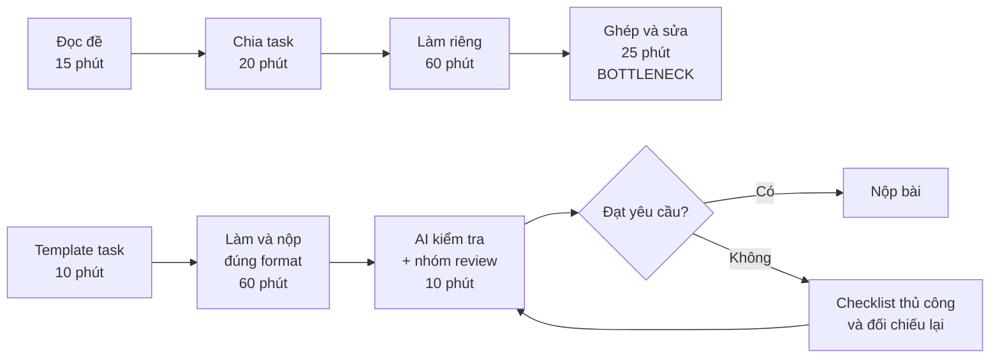
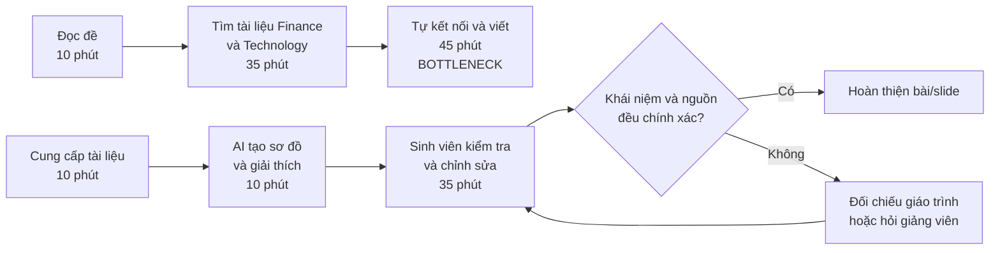
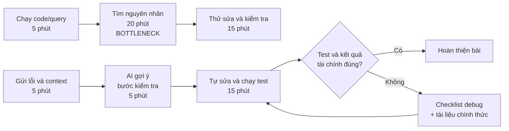

# 01 — Individual Problem Scan

> Điền theo Phase 1 + Phase 2 trong `01-worksheet.md`. Tự scan trước, dùng AI sau để phản biện. Không copy ví dụ Weekly Report.

## Thông tin cá nhân

- Họ và tên: Nguyễn Thị Bảo Trang
- Mã học viên: 2A202602580
- Vai trò / bối cảnh (VD: sinh viên năm X, intern PM, ...): Sinh viên Fintech năm 3
- Công việc hằng tuần (3-5 gạch đầu dòng để soi problem):
	- Tham gia các môn về tài chính, ngân hàng và công nghệ như lập trình, cơ sở dữ liệu hoặc phân tích dữ liệu.
	- Đọc slide, tài liệu và xem recording để chuẩn bị bài tập, quiz và thuyết trình.
	- Làm bài nhóm, phân chia task và ghép phần Finance với phần Technology.
	- Theo dõi lịch học, deadline, lịch họp nhóm và các thông báo từ nhiều kênh.

---

## Phase 1 — Scan 5+ problems (tối thiểu 5, khuyến khích 8-10)

**Cách điền:** mỗi dòng = việc gì + ai chịu + đo bằng gì. Cột `Dấu hiệu thật` bắt buộc có số: mất bao lâu (bấm giờ mấy lần), mấy lần/tuần, bao nhiêu người gặp, log/ticket/quote nào.

| # | Lăng kính (Lặp lại / Tốn thời gian / AI có thể tốt hơn / Pain từ người khác) | Problem quan sát được | Ai chịu ảnh hưởng? | Dấu hiệu thật (số + bằng chứng) |
|---|---|---|---|---|
| 1 | Tốn thời gian | Đọc tài liệu Finance và Technology từ nhiều nguồn để hiểu một chủ đề Fintech | Bản thân và sinh viên cùng môn | Mỗi chủ đề phải xem khoảng 3-5 nguồn; mất khoảng 60-90 phút/lần; cần đo lại qua 2 chủ đề gần nhất |
| 2 | AI có thể tốt hơn | Khó liên kết một khái niệm tài chính với cách công nghệ triển khai khái niệm đó | Sinh viên Fintech năm 3 | Khi làm bài thường phải hỏi lại hoặc tìm thêm ví dụ; ghi nhận khoảng 2-3 lần hỏi lại/chủ đề trong các buổi học gần đây |
| 3 | Lặp lại | Tìm lại slide, recording, công thức hoặc đoạn code cũ trước khi làm bài | Bản thân | Kiểm tra LMS, Drive và tin nhắn khoảng 3-5 lần/tuần; mỗi lần tìm khoảng 5-15 phút |
| 4 | Tốn thời gian | Theo dõi lịch học, deadline, quiz, thuyết trình và lịch họp nhóm từ nhiều kênh | Bản thân và thành viên nhóm | Mỗi tuần phải kiểm tra khoảng 4 kênh; mất khoảng 10 phút/ngày; cần đối chiếu với lịch học thực tế |
| 5 | Lặp lại | Khó sắp xếp thứ tự ưu tiên khi nhiều deadline Finance và Tech đến gần nhau | Bản thân | Có khoảng 3-5 đầu việc học tập trong một tuần bận; từng phải làm bài sát deadline ít nhất 1-2 lần trong tháng gần đây |
| 6 | Pain từ người khác | Thành viên nhóm không hiểu thống nhất về yêu cầu bài và đầu ra của từng task | Thành viên nhóm | Mỗi bài nhóm có thể phải hỏi lại khoảng 3-5 lần trong group chat; có ít nhất 1 lần sửa phần việc sau khi ghép bài |
| 7 | Pain từ người khác | Khó bàn giao task giữa người mạnh Finance và người mạnh Technology | Thành viên nhóm | Khi ghép bài thường mất khoảng 30-60 phút để giải thích lại dữ liệu, công thức hoặc logic code; cần kiểm tra qua bài nhóm gần nhất |
| 8 | Tốn thời gian | Chuyển đổi giữa Excel, Python/SQL, tài liệu môn học và slide khi làm project Fintech | Sinh viên làm project | Một project thường dùng khoảng 4 công cụ; mất khoảng 15-30 phút để chuyển format hoặc kiểm tra dữ liệu mỗi lần |
| 9 | AI có thể tốt hơn | Không biết cách kiểm tra nhanh công thức tài chính, kết quả phân tích hoặc lỗi code | Bản thân | Mỗi bài thực hành có thể gặp 2-4 lỗi cần tra cứu; một lỗi khó mất khoảng 20-40 phút để tìm nguyên nhân |
| 10 | Pain từ người khác | Khó giải thích một nội dung Fintech sao cho cả người thiên về Finance và người thiên về Tech cùng hiểu | Thành viên nhóm và người nghe thuyết trình | Khi chuẩn bị presentation thường phải sửa cách diễn đạt 2-3 lần; có thể ghi lại số câu hỏi người nghe hỏi lại |

> Gợi ý tự soi: tuần trước mất nhiều thời gian nhất vào việc gì? Việc gì hay trì hoãn? Người khác hay hỏi lại câu gì? Workflow nào ai cũng biết là chậm?

**AI đã dùng ở Phase 1 (nếu có):**
- Prompt đã hỏi: "Tôi là sinh viên Fintech năm 3, hằng tuần học các môn Finance và Technology, làm bài cá nhân và bài nhóm. Hãy gợi ý thêm các problem cụ thể theo 4 lăng kính: lặp lại, tốn thời gian, AI có thể tốt hơn và pain từ người khác. Với mỗi problem, hãy nêu actor, workflow sơ bộ và cách đo. Không gợi ý giải pháp AI quá rộng."
- Ý dùng được: Khó liên kết kiến thức Finance với Technology; theo dõi deadline từ nhiều kênh; bàn giao task giữa thành viên mạnh hai mảng khác nhau; tìm lại tài liệu và code cũ.
- Ý bỏ vì không phải pain thật: "AI làm gia sư cá nhân cho mọi môn", "AI tự làm toàn bộ project Fintech" và các ý không có workflow cụ thể hoặc chưa từng xảy ra trong trải nghiệm học tập của tôi.

**Self-check Phase 1:**
- [x] Đủ 5+ dòng, mỗi dòng có actor + số đo cụ thể
- [x] Dùng ít nhất 3/4 lăng kính
- [x] Không có dòng chung chung kiểu "mất nhiều thời gian"

---

## Phase 2 — Top 3 Problem Cards

### 2.1. Chọn top 3

Giữ bài nào: actor cụ thể, workflow vẽ được 3-7 bước, bottleneck ở 1 bước, impact đo được. Loại bài quá rộng.

| Rank | Problem (copy từ bảng scan) | Vì sao chọn (2-3 ý) | Điều còn chưa chắc |
|---|---|---|---|
| 1 | Khó bàn giao task giữa người mạnh Finance và người mạnh Technology | Actor và workflow nhóm rõ; thời gian ghép bài, số lần hỏi lại và số lần sửa có thể đo; đúng đặc thù bài tập Fintech | Chưa chắc nguyên nhân chính là task không rõ hay thành viên thiếu kiến thức; cần kiểm tra qua một bài nhóm gần đây |
| 2 | Khó liên kết một khái niệm tài chính với cách công nghệ triển khai khái niệm đó | Thể hiện đúng khó khăn khi học Fintech; có thể đo thời gian đọc, số nguồn và số lần hỏi lại; có thể thử sơ đồ hoặc workflow hỗ trợ | "Hiểu được" khó đo; cần xác định bottleneck là nối hai mảng hay do tài liệu/đề bài khó |
| 3 | Không biết cách xác định và xử lý lỗi Python/SQL trong bài phân tích tài chính | Workflow lặp lại; thời gian xử lý lỗi và số lần thử sửa dễ ghi nhận; có thể kiểm tra cả lỗi kỹ thuật lẫn tính đúng đắn của kết quả | Cần tách rõ lỗi code với lỗi logic tài chính; phải xác định nguồn dùng để kiểm chứng kết quả |

### 2.2. Problem Cards chi tiết (lặp lại cho cả 3 cards)

---

#### Problem Card #1 — Bàn giao task giữa Finance và Technology

```text
Problem 1 câu: Trong bài nhóm Fintech, các thành viên mạnh ở Finance và Technology thường khó bàn giao phần việc cho nhau vì task chưa ghi rõ input, output và tiêu chí hoàn thành, khiến nhóm phải hỏi lại và sửa khi ghép bài.

Actor: Sinh viên Fintech năm 3 làm bài nhóm gồm các thành viên có nền tảng Finance và Technology khác nhau.

Thời điểm / bối cảnh: Khi bắt đầu một project hoặc trước hạn nộp, đặc biệt ở bước ghép công thức tài chính, dữ liệu, code và báo cáo.

Current workflow 3-7 bước:
1. Đọc đề bài chung.
2. Họp và chia phần Finance, Technology, dữ liệu hoặc slide.
3. Mỗi thành viên làm phần được giao.
4. Gửi file hoặc nội dung vào group chat.
5. Ghép các phần và kiểm tra sự thống nhất.
6. Hỏi lại, sửa lỗi và hoàn thiện bài.

Bottleneck: Bước 5, ghép và kiểm tra các phần, vì input, output, công thức, biến số hoặc tiêu chí hoàn thành chưa thống nhất.

Impact: Nhóm mất khoảng 30-60 phút để giải thích lại phần việc và có thể phải sửa 1-2 lần sau khi ghép; việc bàn giao không rõ làm tăng áp lực trước deadline.

Success metric: Giảm thời gian ghép và giải thích lại từ 30-60 phút xuống dưới 20 phút; giảm số lần hỏi lại từ khoảng 3-5 lần/bài xuống tối đa 1-2 lần; không tăng lỗi không nhất quán trong bài cuối.

Non-AI alternative: Dùng template chia task gồm owner, input, output, deadline, format file và tiêu chí hoàn thành; tổ chức một lần handoff ngắn trước khi ghép bài.

AI hypothesis: AI chuyển đề bài thành checklist task và kiểm tra các phần đã nộp có thiếu input, output, thuật ngữ hoặc mâu thuẫn giữa Finance và Technology hay không. Thành viên vẫn tự làm và nhóm vẫn duyệt nội dung cuối.

Quick gut:
[ ] No AI / process fix
[ ] Rule
[x] Workflow
[ ] Agent
[ ] Chưa biết
```

**Draft workflow Card #1** (ASCII / Mermaid / ảnh đính kèm):

```text
CURRENT STATE — 120 phút

[1 Đọc đề: 15'] → [2 Chia task: 20'] → [3 Làm riêng: 60'] → [4 Ghép và sửa: 25']  <-- bottleneck

FUTURE STATE — 80 phút

[1 Template task: 10'] → [2 Làm và nộp đúng format: 60'] → [3 AI kiểm tra + nhóm review: 10']  <-- human boundary

Fallback: nếu AI kiểm tra thiếu hoặc sai, nhóm dùng checklist thủ công và tự đối chiếu công thức, dữ liệu, code trước khi nộp.
```



File hình ảnh: [01-individual-problem-scan-workflow-card-1.svg](01-individual-problem-scan-workflow-card-1.svg)

---

#### Problem Card #2 — Kết nối kiến thức Finance và Technology

```text
Problem 1 câu: Khi học hoặc làm bài Fintech, sinh viên mất nhiều thời gian để liên kết một khái niệm Finance với cách Technology triển khai khái niệm đó trong thực tế.

Actor: Sinh viên Fintech năm 3 phải làm bài tập hoặc thuyết trình có cả nội dung Finance và Technology.

Thời điểm / bối cảnh: Khi nhận đề bài liên ngành, trước buổi thuyết trình hoặc khi cần giải thích một quy trình Fintech.

Current workflow 3-7 bước:
1. Đọc yêu cầu bài.
2. Tìm tài liệu Finance.
3. Tìm tài liệu Technology.
4. Tự nối khái niệm tài chính với công nghệ.
5. Hỏi bạn hoặc tìm thêm ví dụ.
6. Viết câu trả lời hoặc làm slide.

Bottleneck: Bước 4, vì hai mảng được học từ các nguồn khác nhau và chưa có ví dụ chung để nối khái niệm với cách triển khai.

Impact: Một chủ đề có thể cần đọc 3-5 nguồn và mất khoảng 60-90 phút; sinh viên dễ hiểu từng phần riêng lẻ nhưng giải thích mối liên hệ chưa rõ.

Success metric: Giảm thời gian chuẩn bị một chủ đề từ 60-90 phút xuống khoảng 40-60 phút; giảm số lần hỏi lại từ 2-3 lần xuống tối đa 1 lần; giải thích được khái niệm, công nghệ và ví dụ ứng dụng.

Non-AI alternative: Xây dựng glossary Finance-Tech, sơ đồ khái niệm và bộ ví dụ ứng dụng theo từng chủ đề.

AI hypothesis: AI tạo bản giải thích theo cấu trúc khái niệm Finance → công nghệ liên quan → ví dụ quy trình → giới hạn và rủi ro. Sinh viên kiểm tra lại bằng slide, giáo trình và tài liệu chính thức.

Quick gut:
[ ] No AI / process fix
[ ] Rule
[x] Workflow
[ ] Agent
[ ] Chưa biết
```

**Draft workflow Card #2:**

```text
CURRENT STATE — 90 phút

[1 Đọc đề: 10'] → [2 Tìm tài liệu: 35'] → [3 Tự kết nối và viết: 45']  <-- bottleneck

FUTURE STATE — 55 phút

[1 Cung cấp tài liệu: 10'] → [2 AI tạo sơ đồ/giải thích: 10'] → [3 Sinh viên kiểm tra và chỉnh sửa: 35']  <-- human boundary

Fallback: nếu AI nối sai hai mảng hoặc dùng khái niệm không có trong tài liệu, bỏ phần gợi ý đó và tự đối chiếu lại với giáo trình hoặc hỏi giảng viên.
```



File hình ảnh: [01-individual-problem-scan-workflow-card-2.svg](01-individual-problem-scan-workflow-card-2.svg)

---

#### Problem Card #3 — Xử lý lỗi Python/SQL trong bài phân tích tài chính

```text
Problem 1 câu: Khi làm bài phân tích dữ liệu tài chính bằng Python hoặc SQL, sinh viên mất nhiều thời gian xác định nguyên nhân lỗi và kiểm tra xem kết quả sau khi sửa có đúng hay không.

Actor: Sinh viên Fintech năm 3 làm bài thực hành hoặc project phân tích dữ liệu tài chính.

Thời điểm / bối cảnh: Khi chạy code/query để làm sạch, tính toán hoặc trực quan hóa dữ liệu giao dịch.

Current workflow 3-7 bước:
1. Chạy code hoặc query.
2. Đọc thông báo lỗi hoặc kiểm tra kết quả bất thường.
3. Tìm nguyên nhân trong tài liệu và trên Internet.
4. Thử cách sửa.
5. Chạy lại và kiểm tra kết quả.
6. Hỏi bạn nếu vẫn chưa giải quyết được.

Bottleneck: Bước 3-4, vì lỗi có thể đến từ cú pháp, kiểu dữ liệu, dữ liệu đầu vào hoặc logic tính toán.

Impact: Một bài có thể gặp 2-4 lỗi; mỗi lỗi khó mất khoảng 20-40 phút, và code chạy được vẫn có thể cho kết quả sai về mặt tài chính.

Success metric: Giảm thời gian xử lý một lỗi từ 20-40 phút xuống dưới 20 phút; giảm số lần thử sửa; mọi thay đổi phải được kiểm tra bằng test case và công thức hoặc tài liệu môn học.

Non-AI alternative: Dùng checklist debug, test case nhỏ, tài liệu Python/SQL chính thức và bộ dữ liệu mẫu có kết quả kỳ vọng.

AI hypothesis: AI giải thích error message, gợi ý thứ tự kiểm tra và đưa ra các khả năng nguyên nhân. Sinh viên tự sửa code, chạy test và đối chiếu kết quả tài chính với nguồn tin cậy.

Quick gut:
[ ] No AI / process fix
[ ] Rule
[x] Workflow
[ ] Agent
[ ] Chưa biết
```

**Draft workflow Card #3:**

```text
CURRENT STATE — 40 phút

[1 Chạy code: 5'] → [2 Tìm nguyên nhân: 20'] → [3 Thử sửa và kiểm tra: 15']  <-- bottleneck

FUTURE STATE — 25 phút

[1 Gửi lỗi và context: 5'] → [2 AI gợi ý bước kiểm tra: 5'] → [3 Tự sửa và chạy test: 15']  <-- human boundary

Fallback: nếu AI đưa ra cách sửa không giải thích được hoặc kết quả không khớp test case, bỏ gợi ý và quay lại checklist debug cùng tài liệu chính thức.
```



File hình ảnh: [01-individual-problem-scan-workflow-card-3.svg](01-individual-problem-scan-workflow-card-3.svg)

---

### 2.3. Card muốn pitch nhất (chuẩn bị 2 phút)

**Card tôi muốn pitch nhất:**

```text
Bàn giao task giữa thành viên mạnh Finance và Technology.
```

**Vì sao (2-3 câu: workflow gì, số đo gì, impact gì):**

```text
Trong các bài nhóm Fintech, mỗi thành viên thường làm một phần riêng nhưng nhóm gặp khó khăn khi ghép công thức Finance, dữ liệu, code và báo cáo. Problem này có workflow rõ, có thể đo thời gian ghép bài, số lần hỏi lại và số lần sửa. Tôi muốn kiểm tra trước một template handoff không dùng AI, sau đó mới xem AI có cần thiết để phát hiện thiếu hoặc mâu thuẫn giữa các phần hay không.
```

**Câu hỏi tôi muốn nhóm challenge (1-2 câu hỏi đúng chỗ yếu):**

```text
Nguyên nhân chính là task chưa rõ hay thành viên chưa đủ kiến thức? Nếu dùng template gồm owner, input, output và tiêu chí hoàn thành thì số lần hỏi lại có giảm không? AI có phát hiện được lỗi logic thật hay chỉ kiểm tra được format và sự thiếu thông tin?
```

**AI phản biện Card (nếu có):**
- Điểm yếu AI chỉ ra: Problem ban đầu gộp nhiều nguyên nhân như chia task, thiếu kiến thức và lỗi ghép bài; metric "bài làm tốt hơn" chưa đủ cụ thể; AI không nên tự đánh giá tính đúng đắn của công thức hoặc code.
- Tôi sửa gì: Thu hẹp bottleneck vào bước handoff và ghép bài; thêm metric về thời gian, số lần hỏi lại và số lần sửa; đưa template/checklist thành non-AI alternative và giữ nhóm ở vị trí kiểm tra cuối.

### Self-check nộp phần 01
- [x] Có 5+ problems + top 3 Cards đủ field
- [x] Mỗi Card có workflow trước/sau + bottleneck + metric + fallback
- [x] Đã chọn 1 card pitch + câu hỏi challenge
